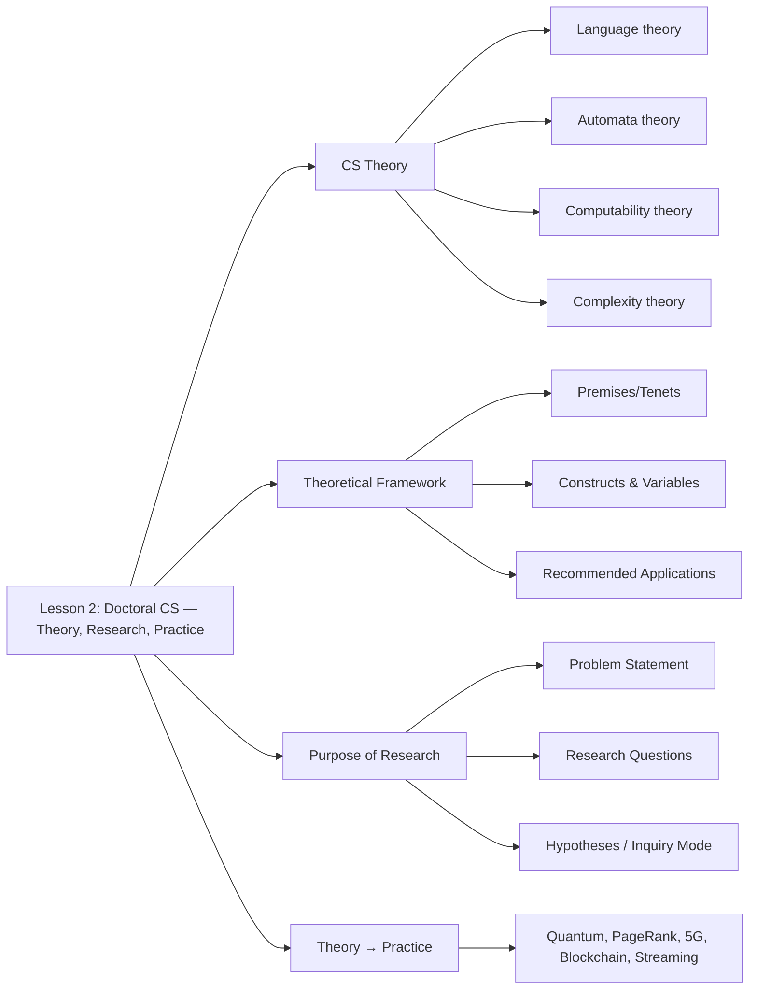

# CSC-8102 · Lesson 2 Study Plan
## Theory, Research, and Practice Relevant to Doctoral Computer Science

> **Module:** Module 1 — History, Theory, Concepts, and Techniques in CS
> **Week:** 2 of 8  ·  **Lesson window:** Mon Aug 31 – Sun Sep 6, 2026
> **Assignment due:** Sunday, Sep 6, 2026, 11:58 PM · **Points:** 10
> **Deliverable file:** `CervantesH8102-2.docx` · **Status:** ⬜ Not Started

---

## 1. Lesson Snapshot

| Item | Detail |
|---|---|
| Concept topic | Theory, research, and practice relevant to doctoral computer science |
| Course Learning Outcome (CLO) | CLO 2 — Explain the core concepts necessary for doctoral study and research in computer science |
| Program Learning Outcome | PLO 1 — Develop knowledge in CS based on a synthesis of current theories |
| Institutional Learning Outcome | ILO 6 — Research Skills |
| Linked assignment | Assignment 2: Determine Important Ph.D. Approaches in Computer Science |
| Turnitin | Enabled — run a pre-check before final submit |

**Why this lesson matters.** Lesson 1 established the history and foundations of computing. Lesson 2 shifts the focus from *what computer science is* to *how a doctoral researcher does CS* — connecting theory, research, and practice so you can add meaningfully to the extant body of literature. The skills here (problem statement, purpose statement, research questions, theoretical framework, theory selection) are the scaffolding you will reuse in every later lesson and in your dissertation.

---

## 2. Lesson 2 Core Concepts (from the lesson content)

Read and internalize these five concept blocks before touching the readings — they are the spine of Assignment 2.

### 2.1 Computer Science Theory
- CS theory is grounded in **computational thinking and processing** — the intersection of CS and mathematics.
- Theories based on information systems or technology are **not necessarily** CS-based. The doctoral researcher must make this distinction.
- Emphasis is on **algorithmic processes and interaction**, and on determining possibilities for advancement and the limits imposed by computational limitations.
- The physical world is modeled with differential equations; the computational world is **described, understood, and manipulated using algorithms and computation**. This frames the CS researcher's goal: identify key issues in the literature whose enhancement catalyzes growth in the field.

### 2.2 Deconstructing the Theoretical Framework
- A theoretical framework is written by author(s) to "frame" a set of ideas/constructs surrounding a phenomenon.
- Components: **basic premises/tenets** (accepted principles), a **vocabulary of terms**, **constructs** with operationally defined **variables**, and **recommended applications** drawn from seminal research.
- CS theories of computation fall into four subcategories — choose the framework that matches your research focus:

| If research involves… | Select framework within… |
|---|---|
| Expression of computation | **Language** theory |
| How computations are processed | **Automata** theory |
| Limitations of computation | **Computability** theory |
| Resources (time & space) to perform computation | **Complexity** theory |

- Example constructs/variables (Theory of Complexity, Dean 2021): single step ↔ single-cell of scratch memory; linear/log/quadratic/polynomial/exponential time ↔ corresponding space classes.

### 2.3 The Purpose of Research
- The primary purpose of doctoral (Ph.D.) research is to **add to the extant body of literature in a meaningful way** and provide insight that changes a course of action in the field.
- Output must be **generalizable** to the larger population.
- Process: problem statement (nature/extent, impact of not solving, gap in literature) → research questions (aligned to the framework) → for quantitative, hypotheses couplets (null + alternative); for qualitative, mode of inquiry + data collection method → analyses → conclusions applied to the real world → new research questions. Research is **perpetual**; prior output catalyzes future research.

### 2.4 Connecting Theory to Practice
- Real-world technologies founded on theoretical principles: **quantum computing**, Google's PageRank, **polar codes for 5G**, **blockchain/cryptography** in cryptocurrencies, coding & algorithm theory improving **Netflix/Amazon Prime streaming**.
- CS theory emphasizes the computational aspects of a domain problem to drive innovation, sometimes via unconventional/novel approaches.

### 2.5 The Doctoral Mindset & Theoretical Lens (from supporting guides)
- Theoretical framework = the **"lens"** that grounds the research focus within theoretical underpinnings and frames inquiry for data analysis/interpretation.
- Three starting considerations: (1) Discipline/field & PhD-vs-applied, (2) relevant theory(ies), (3) original theorist(s) and who adapted them to your discipline.
- A **theoretical contribution** is the theory-driven input to current thinking; revisit the framework in Chapter 5 when describing your study's contribution.

---

## 3. Readings & Resources (from the Lesson 2 Resource Guide)

### Required readings
1. **Computer Science Theory from a Practical Point of View** — Maurer, P. M. (2021). *2021 Intl. Conf. on Computational Science and Computational Intelligence (CSCI)*, 920–924. → *Describes the link between theory and the real world through the lens of the mathematical machine; explains types of automata (FSMs, PDAs, Turing machines) and their practical applications.*
2. **A Theory of Consciousness from a Theoretical Computer Science Perspective: Insights from the Conscious Turing Machine** — Blum, L., & Blum, M. (2022). *PNAS, 119*(21). → *Examines consciousness using CS theory as a lens; uses the Conscious Turing Machine (CTM), Turing Machine (TM), and Global Workspace Theory (GWT) to conceptualize human consciousness.*
3. **Computers in Abstraction/Representation Theory** — Fletcher, S. C. (2018). *Minds & Machines, 28*(3), 445–463. → *Develops a novel theoretical framework, Abstraction/Representation (AR) theory, for conceptualizing novel forms of computation.*
4. **Dissertation Center** — materials on selecting a research topic, forming problem statements, purpose statements, and research questions.
5. **The Theoretical Framework** (Center for Teaching & Learning brochure) — purpose of the theoretical framework in doctoral research + a valuable checklist.
6. **Theories Used in IS Research** — summaries of theories widely used in IS research; click a theory for details, example papers, and related links.

### Optional / supplementary readings
- **Probability in Electrical Engineering and Computer Science** — Walrand, J. (2021). Springer. → *Applied probability techniques across EE and CS; demonstrates the theory-to-use-case link.*
- **Foundations of Software Science and Computation Structures** (2022). Springer. → *CS theory applied to analysis, integration, synthesis, transformation, and verification of programs/software systems.*

### In-library supporting documents already uploaded
- `Theoretical_Framework.pdf` — the CTL brochure (item 5 above).
- `Computer_Science_Theory_from_a_Practical_Point_of_View.pdf` — Maurer (2021).
- `The Doctoral Mindset: Part 2 — Bringing Focus to the Problem` (video) — complements problem-statement formation.
- `LibGuides: Dissertation and Applied Doctoral Project Components: Problem Statement` — problem-statement guidance.

---

## 4. Assignment 2 — What You Must Deliver

**Prompt.** Write a scholarly research paper (current APA, Turnitin-checked) that addresses:

1. Visit the Dissertation Center and read materials on **problem statement, purpose statement, and research questions**.
2. Review the **Theoretical Framework** page to understand using theory as a lens for inquiry.
3. **Describe the role** of the problem statement, purpose statement, and research questions in CS research.
4. **Describe the relevance** of theory and research to the CS Ph.D. — purpose, utility, and importance to your study.
5. **Explain how** a theoretical approach to research informs practice.
6. Browse the **Theories Used in IS Research** page.
7. **Select three theories** directly relevant to a specific CS knowledge area. Describe the knowledge area and list the three theories to frame your inquiry.
8. **Synthesize and define the tenets** of each theory — basic premises, constructs, variables, and goals for research application.
9. **Search three (3) peer-reviewed journal articles** related to CS research that use a theoretical framework; explain the value of the theoretical framework for each study.

**Constraints.**
- Length: **6–11 pages** (excluding title & reference pages).
- References: course resources + **≥ 3 recent peer-reviewed** library/standards resources.
- Scholarly writing, current APA, Academic Integrity Policy.

### Rubric (total /10) — how to score maximum
| Criterion | Max | "Exceeds" bar |
|---|---|---|
| Explanation & synthesis of core concepts for doctoral study (peer-reviewed supported) | 3 | Strong evidence of understanding the doctoral research process via synthesis + explanation |
| Assignment Instructions | 2 | Correctly completed **all** instructions |
| Content & Critical Thinking | 2 | Strong content knowledge; thoughtful, thorough, well-reasoned responses |
| Cohesion & Organization | 2 | Central idea present throughout, coherent & logical, easy to understand |
| Grammar, Mechanics, Formatting, APA, Integration of Resources | 1 | No errors; all resources scholarly & appropriate |

> **Scoring tip:** The synthesis/explanation criterion (3 pts) and the "complete all instructions" criterion (2 pts) together are half your grade. Tick off items 3–9 explicitly in the paper so the rubric maps visibly to your sections.

---

## 5. Suggested Topic — A Head Start

If you have not yet chosen a CS knowledge area and three theories, consider this ready-made mapping you can adopt or adapt:

- **Knowledge area:** *Computability & Complexity* (subcategories from §2.2).
- **Theory 1 — Computability theory** (Turing, decidability): premises = computation as effective procedure; constructs = decidable/recognizable languages; variables = halting behavior; goal = characterize solvable problems.
- **Theory 2 — Complexity theory** (Dean, 2021): premises = resource bounds on computation; constructs = time/space classes; variables = linear/log/polynomial/exponential; goal = classify problem hardness.
- **Theory 3 — Automata theory** (Maurer, 2021): premises = mathematical machines model computation; constructs = FSM/PDA/TM; variables = states, transitions, stack/tape; goal = practical problem-solving tools.

Replace Theory 3 with **Abstraction/Representation theory** (Fletcher, 2018) or the **Conscious Turing Machine** (Blum & Blum, 2022) if your area leans toward computational models of cognition.

---

## 6. Day-by-Day Study Schedule (Week of Aug 31 – Sep 6)

| Day | Focus | Tasks | Output |
|---|---|---|---|
| **Mon Aug 31** | Orient | Read syllabus + course calendar + this plan. Skim Lesson 2 lesson content (Assignment 2 doc). | Concept map of the 5 lesson blocks |
| **Tue Sep 1** | Theory foundation | Read Maurer (2021) + the CS theory lesson block (§2.1–2.2). Take notes on automata/FSM/PDA/TM and the four computation subcategories. | Theory notes; pick your knowledge area |
| **Wed Sep 2** | Theoretical framework | Read the CTL *Theoretical Framework* brochure + the deconstructing-framework block (§2.2). Read Blum & Blum (2022) and Fletcher (2018). | Notes on framework components; shortlist 3 theories |
| **Thu Sep 3** | Research process | Watch *Doctoral Mindset Part 2* + read Dissertation Center problem/purpose/RQ materials + §2.3. Draft problem statement, purpose statement, and 2–3 research questions for your area. | Draft research-problem scaffolding |
| **Fri Sep 4** | Theory synthesis | Browse *Theories Used in IS Research*. Finalize your 3 theories; write each theory's tenets, constructs, variables, goals (Assignment item 8). Begin literature search for 3 peer-reviewed articles using a theoretical framework (item 9). | Theory-synthesis section drafted |
| **Sat Sep 5** | Draft & integrate | Write the relevance-of-theory (item 4) and theory-to-practice (item 5) sections. Insert citations; assemble 6–11 page draft. Run **Turnitin pre-check**. | Full draft + Turnitin pre-check |
| **Sun Sep 6** | Polish & submit | Revise for cohesion/organization, APA, and grammar (last 3 rubric criteria). Finalize references. Save as `CervantesH8102-2.docx`. Submit to Dropbox before 11:58 PM. | Submitted ✅ |

---

## 7. Pre-Submission Checklist

- [ ] All 9 assignment instructions explicitly addressed (item-by-item in the text)
- [ ] Problem statement, purpose statement, and research questions described and exemplified
- [ ] Relevance of theory **and** research explained (purpose, utility, importance)
- [ ] Theory-to-practice link made with concrete examples
- [ ] Three theories named, each with tenets / constructs / variables / goals
- [ ] Three peer-reviewed articles included, each with the **value of its theoretical framework** explained
- [ ] 6–11 pages (excluding title + references)
- [ ] ≥ 3 recent peer-reviewed sources beyond course resources
- [ ] Current APA throughout; all sources scholarly & appropriate
- [ ] Cohesion: one central idea carried throughout, logically ordered
- [ ] Turnitin pre-check run; similarity addressed
- [ ] File named `CervantesH8102-2.docx`; submitted to Dropbox

---

## 8. Concept Map

---

## 9. Source Citations (library documents used to build this plan)

- Course syllabus — *CSC-8102: Principles of Computer Science* (`/libraries/01a057b7-738a-71db-adb1-82ddf4195850?document=0e12b0f7-1d85-4438-a15e-0f08eeb0490f`)
- Course calendar — *csc-8102-course-calendar.xlsx* (`/libraries/01a057b7-738a-71db-adb1-82ddf4195850?document=d5872596-0aa5-4531-a625-85656c6e1a5d`)
- Lesson outline — *LibGuides: CSC-8102: Lesson 2 Resources* (`/libraries/01a057b7-738a-71db-adb1-82ddf4195850?document=b1d525f6-9ca4-4608-b7e2-f0b66e7cb306`)
- Lesson content & assignment — *Assignment 2.docx* (`/libraries/01a057b7-738a-71db-adb1-82ddf4195850?document=576b8e31-830b-48d1-8075-bb882694fa59`)
- Maurer, P. M. (2021). *Computer Science Theory from a Practical Point of View* — *Computer_Science_Theory_from_a_Practical_Point_of_View.pdf* (`/libraries/01a057b7-738a-71db-adb1-82ddf4195850?document=9aa1fede-3d3e-4a79-b9bc-354ff47d6954`)
- Blum, L., & Blum, M. (2022). *A Theory of Consciousness… Conscious Turing Machine* (Lesson 2 Resource Guide)
- Fletcher, S. C. (2018). *Computers in Abstraction/Representation Theory* (Lesson 2 Resource Guide)
- *The Theoretical Framework* brochure — `Theoretical_Framework.pdf` (`/libraries/01a057b7-738a-71db-adb1-82ddf4195850?document=73becc4c-1232-4189-816f-7384162f644f`)
- Dean, W. (2021). *Computational complexity theory.* Stanford Encyclopedia of Philosophy.
