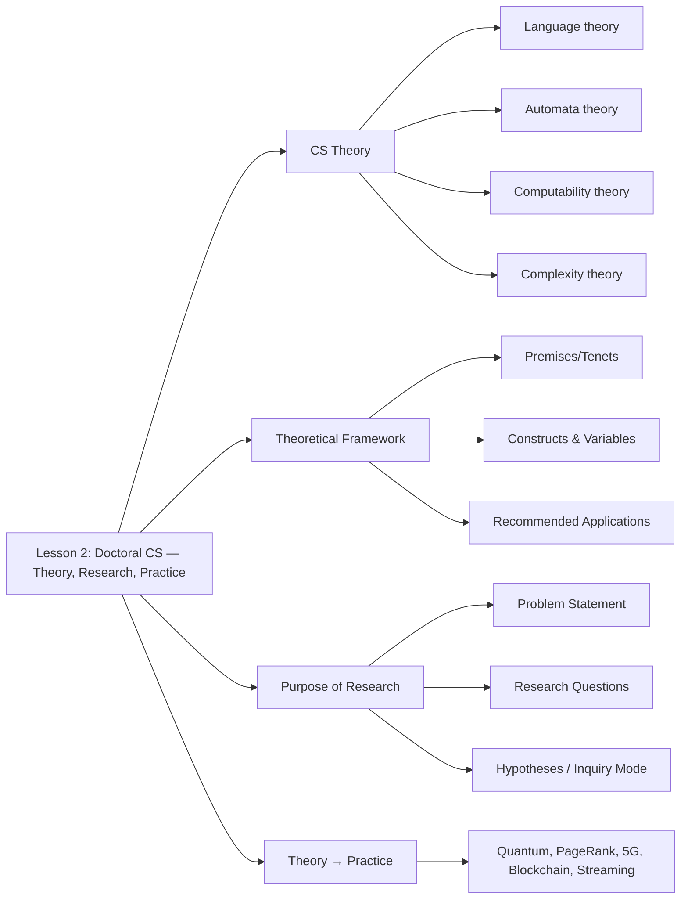

# CSC-8102 · Lesson 2 Study Plan

## Theory, Research, and Practice Relevant to Doctoral Computer Science

> **Module:** Module 1 — History, Theory, Concepts, and Techniques in CS  
> **Week:** 2 of 8  ·  **Lesson window:** Mon Aug 31 – Sun Sep 6, 2026  
> **Assignment due:** Sunday, Sep 6, 2026, 11:58 PM · **Points:** 10  
> **Deliverable file:** `CervantesH8102-2.docx` · **Status:** ⬜ Not Started

---

## 1. Lesson Snapshot

| Item                           | Detail                                                                                          |
| ------------------------------ | ----------------------------------------------------------------------------------------------- |
| Concept topic                  | Theory, research, and practice relevant to doctoral computer science                            |
| Course Learning Outcome (CLO)  | CLO 2 — Explain the core concepts necessary for doctoral study and research in computer science |
| Program Learning Outcome       | PLO 1 — Develop knowledge in CS based on a synthesis of current theories                        |
| Institutional Learning Outcome | ILO 6 — Research Skills                                                                         |
| Linked assignment              | Assignment 2: Determine Important Ph.D. Approaches in Computer Science                          |
| Turnitin                       | Enabled — run a pre-check before final submit                                                   |

**Why this lesson matters.** Lesson 1 established the history and foundations of computing. Lesson 2 shifts the focus from *what computer science is* to *how a doctoral researcher does CS* — connecting theory, research, and practice so you can add meaningfully to the extant body of literature. The skills here (problem statement, purpose statement, research questions, theoretical framework, theory selection) are the scaffolding you will reuse in every later lesson and in your dissertation.

---

## 2. Lesson 2 Core Concepts (from the lesson content)

Read and internalize these five concept blocks before touching the readings — they are the spine of Assignment 2.

### 2.1 Computer Science Theory

- CS theory is grounded in **computational thinking and processing** — the intersection of CS and mathematics.
- Theories based on information systems or technology are **not necessarily** CS-based. The doctoral researcher must make this distinction.
- Emphasis is on **algorithmic processes and interaction**, and on determining possibilities for advancement and the limits imposed by computational limitations.
- The physical world is modeled with differential equations; the computational world is **described, understood, and manipulated using algorithms and computation**. This frames the CS researcher's goal: identify key issues in the literature whose enhancement catalyzes growth in the field.

### 2.2 Deconstructing the Theoretical Framework

- A theoretical framework is written by author(s) to "frame" a set of ideas/constructs surrounding a phenomenon.
- Components: **basic premises/tenets** (accepted principles), a **vocabulary of terms**, **constructs** with operationally defined **variables**, and **recommended applications** drawn from seminal research.
- CS theories of computation fall into four subcategories — choose the framework that matches your research focus:

| If research involves…                               | Select framework within… |
| --------------------------------------------------- | ------------------------ |
| Expression of computation                           | **Language** theory      |
| How computations are processed                      | **Automata** theory      |
| Limitations of computation                          | **Computability** theory |
| Resources (time &amp; space) to perform computation | **Complexity** theory    |

- Example constructs/variables (Theory of Complexity, Dean 2021): single step ↔ single-cell of scratch memory; linear/log/quadratic/polynomial/exponential time ↔ corresponding space classes.

### 2.3 The Purpose of Research

- The primary purpose of doctoral (Ph.D.) research is to **add to the extant body of literature in a meaningful way** and provide insight that changes a course of action in the field.
- Output must be **generalizable** to the larger population.
- Process: problem statement (nature/extent, impact of not solving, gap in literature) → research questions (aligned to the framework) → for quantitative, hypotheses couplets (null + alternative); for qualitative, mode of inquiry + data collection method → analyses → conclusions applied to the real world → new research questions. Research is **perpetual**; prior output catalyzes future research.

### 2.4 Connecting Theory to Practice

- Real-world technologies founded on theoretical principles: **quantum computing**, Google's PageRank, **polar codes for 5G**, **blockchain/cryptography** in cryptocurrencies, coding &amp; algorithm theory improving **Netflix/Amazon Prime streaming**.
- CS theory emphasizes the computational aspects of a domain problem to drive innovation, sometimes via unconventional/novel approaches.

### 2.5 The Doctoral Mindset &amp; Theoretical Lens (from supporting guides)

- Theoretical framework = the **"lens"** that grounds the research focus within theoretical underpinnings and frames inquiry for data analysis/interpretation.
- Three starting considerations: (1) Discipline/field &amp; PhD-vs-applied, (2) relevant theory(ies), (3) original theorist(s) and who adapted them to your discipline.
- A **theoretical contribution** is the theory-driven input to current thinking; revisit the framework in Chapter 5 when describing your study's contribution.

---

## 3. Readings &amp; Resources (from the Lesson 2 Resource Guide)

### Required readings

1. **Computer Science Theory from a Practical Point of View** — Maurer, P. M. (2021). *2021 Intl. Conf. on Computational Science and Computational Intelligence (CSCI)*, 920–924. → *Describes the link between theory and the real world through the lens of the mathematical machine; explains types of automata (FSMs, PDAs, Turing machines) and their practical applications.*
2. **A Theory of Consciousness from a Theoretical Computer Science Perspective: Insights from the Conscious Turing Machine** — Blum, L., &amp; Blum, M. (2022). *PNAS, 119*(21). → *Examines consciousness using CS theory as a lens; uses the Conscious Turing Machine (CTM), Turing Machine (TM), and Global Workspace Theory (GWT) to conceptualize human consciousness.*
3. **Computers in Abstraction/Representation Theory** — Fletcher, S. C. (2018). *Minds &amp; Machines, 28*(3), 445–463. → *Develops a novel theoretical framework, Abstraction/Representation (AR) theory, for conceptualizing novel forms of computation.*
4. **Dissertation Center** — materials on selecting a research topic, forming problem statements, purpose statements, and research questions.
5. **The Theoretical Framework** (Center for Teaching &amp; Learning brochure) — purpose of the theoretical framework in doctoral research + a valuable checklist.
6. **Theories Used in IS Research** — summaries of theories widely used in IS research; click a theory for details, example papers, and related links.

### Optional / supplementary readings

- **Probability in Electrical Engineering and Computer Science** — Walrand, J. (2021). Springer. → *Applied probability techniques across EE and CS; demonstrates the theory-to-use-case link.*
- **Foundations of Software Science and Computation Structures** (2022). Springer. → *CS theory applied to analysis, integration, synthesis, transformation, and verification of programs/software systems.*

### In-library supporting documents already uploaded

- `Theoretical_Framework.pdf` — the CTL brochure (item 5 above).
- `Computer_Science_Theory_from_a_Practical_Point_of_View.pdf` — Maurer (2021).
- `The Doctoral Mindset: Part 2 — Bringing Focus to the Problem` (video) — complements problem-statement formation.
- `LibGuides: Dissertation and Applied Doctoral Project Components: Problem Statement` — problem-statement guidance.

---

## 4. Assignment 2 — What You Must Deliver

**Prompt.** Write a scholarly research paper (current APA, Turnitin-checked) that addresses:

1. Visit the Dissertation Center and read materials on **problem statement, purpose statement, and research questions**.
2. Review the **Theoretical Framework** page to understand using theory as a lens for inquiry.
3. **Describe the role** of the problem statement, purpose statement, and research questions in CS research.
4. **Describe the relevance** of theory and research to the CS Ph.D. — purpose, utility, and importance to your study.
5. **Explain how** a theoretical approach to research informs practice.
6. Browse the **Theories Used in IS Research** page.
7. **Select three theories** directly relevant to a specific CS knowledge area. Describe the knowledge area and list the three theories to frame your inquiry.
8. **Synthesize and define the tenets** of each theory — basic premises, constructs, variables, and goals for research application.
9. **Search three (3) peer-reviewed journal articles** related to CS research that use a theoretical framework; explain the value of the theoretical framework for each study.

**Constraints.**

- Length: **6–11 pages** (excluding title &amp; reference pages).
- References: course resources + **≥ 3 recent peer-reviewed** library/standards resources.
- Scholarly writing, current APA, Academic Integrity Policy.

### Rubric (total /10) — how to score maximum

| Criterion                                                                                 | Max | "Exceeds" bar                                                                              |
| ----------------------------------------------------------------------------------------- | --- | ------------------------------------------------------------------------------------------ |
| Explanation &amp; synthesis of core concepts for doctoral study (peer-reviewed supported) | 3   | Strong evidence of understanding the doctoral research process via synthesis + explanation |
| Assignment Instructions                                                                   | 2   | Correctly completed **all** instructions                                                   |
| Content &amp; Critical Thinking                                                           | 2   | Strong content knowledge; thoughtful, thorough, well-reasoned responses                    |
| Cohesion &amp; Organization                                                               | 2   | Central idea present throughout, coherent &amp; logical, easy to understand                |
| Grammar, Mechanics, Formatting, APA, Integration of Resources                             | 1   | No errors; all resources scholarly &amp; appropriate                                       |

> **Scoring tip:** The synthesis/explanation criterion (3 pts) and the "complete all instructions" criterion (2 pts) together are half your grade. Tick off items 3–9 explicitly in the paper so the rubric maps visibly to your sections.

---

## 5. Selected Knowledge Area &amp; Three IS Theories (Assignment Items 7–8)

> Source: *Theories Used in IS Research Wiki* (Larsen et al., 2025), [https://is.theorizeit.org/wiki/Main\_Page](https://is.theorizeit.org/wiki/Main_Page) — the resource the assignment instructs you to browse.

### 5.1 Knowledge Area of Focus

**Compulsive Social-Media Use and Time-Wasting Behavior** — the study of how users become absorbed in social apps, lose track of time, and continue scrolling despite negative consequences (lost productivity, delayed tasks). This area sits at the intersection of computer science (the design of attention-capturing platforms and algorithms) and information systems (user behavior with digital technologies).

**Why this area:** It lets one theory cover *absorption/time loss* (Flow), one cover *continued use* (IS Continuance), and one cover *habit formation* (Social Cognitive). Together they frame a full inquiry: Why do I lose hours? → Why do I keep coming back? → How did this habit form?

### 5.2 The Three Theories (to frame the inquiry)

| #   | Theory                  | Originator(s)           | Wiki link                                        |
| --- | ----------------------- | ----------------------- | ------------------------------------------------ |
| 1   | Flow Theory             | Csikszentmihalyi (1975) | is.theorizeit.org/wiki/Flow\_theory              |
| 2   | IS Continuance Theory   | Bhattacherjee (2001)    | is.theorizeit.org/wiki/IS\_Continuance\_Theory   |
| 3   | Social Cognitive Theory | Bandura (1986)          | is.theorizeit.org/wiki/Social\_cognitive\_theory |

### 5.3 Tenets, Constructs, Variables &amp; Goals — Draft Synthesis (Assignment Item 8)

**Theory 1 — Flow Theory**

- *Basic premises/tenets:* A flow state occurs when perceived challenges and skills are balanced, leading to deep concentration, loss of self-consciousness, time distortion, and intrinsic enjoyment.
- *Constructs:* Concentration; Time distortion; Intrinsic enjoyment; Clear goals; Immediate feedback; Balance of challenge and skill.
- *Variables:* Perceived challenge of the task; perceived skill of the user; clarity of goals; immediacy of feedback; sense of control.
- *Goal for research application:* Explain immersive experiences that cause users to lose track of time while scrolling, and identify design features that trigger flow (e.g., auto-play, infinite scroll).

**Theory 2 — IS Continuance Theory**

- *Basic premises/tenets:* Post-adoption behavior is driven by user satisfaction, which in turn is determined by confirmation of expectations about the IS; satisfaction then leads to continued intention and continued use.
- *Constructs:* Confirmation of expectations; Satisfaction; Continued intention to use; Continued use behavior.
- *Variables:* Perceived usefulness (confirmation); perceived ease of use (confirmation); disconfirmation; satisfaction level; intention to continue; actual continued use frequency/duration.
- *Goal for research application:* Predict and explain why users keep returning to social apps even when they recognize the negative consequences, isolating satisfaction and expectation-confirmation as levers.

**Theory 3 — Social Cognitive Theory**

- *Basic premises/tenets:* Behavior is learned and regulated through the continuous reciprocal interaction among cognition, behavior, and the environment; people learn by observing others and by direct experience, and reinforcement (including social reinforcement) shapes behavior.
- *Constructs:* Observational learning; Self-efficacy; Outcome expectations; Behavioral capability; Self-regulation; Environmental influences.
- *Variables:* Attention to modeled behavior; retention of observed behavior; motor reproduction capability; motivation (including incentives and social reinforcement); self-efficacy beliefs.
- *Goal for research application:* Explain how scrolling habits are acquired (observing peers, viral challenges) and maintained (likes, notifications, variable rewards), and how interventions can break the cycle by altering outcome expectations or boosting self-efficacy to resist.

### 5.4 How the Three Theories Frame the Inquiry

- **Flow Theory** answers *Why do I lose hours?* — frames the absorption/immersion that makes time disappear.
- **IS Continuance Theory** answers *Why do I keep coming back?* — frames the continuation of use beyond the initial adoption decision.
- **Social Cognitive Theory** answers *How did this habit form?* — frames the learning and reinforcement loop that sustains the behavior.

### 5.5 Alternatives (swap any of the three from the same wiki if preferred)

- **Theory of Planned Behavior** — if you want to model *intentions* to limit scrolling, but it is less direct for the addiction angle.
- **Habit** — not explicitly on the wiki list; IS Continuance Theory covers the same post-adoption terrain.
- **Addiction / Addictive Behavior Theory** — not on the wiki list; the IS field typically uses Flow + Continuance + Social Cognitive to cover compulsive use.

### 5.6 Source

Larsen, K. R., Saini, V., Singh, N. B., &amp; Mueller, R. M. (Eds.). (2025). *Theories Used in IS Research Wiki*. Retrieved September 3, 2026, from [http://IS.TheorizeIt.org](http://IS.TheorizeIt.org)

---

## 6. Three Peer-Reviewed Articles Using a Theoretical Framework (Assignment Item 9)

Each article below is peer-reviewed, recent, and applies one of the three selected theories to the AI / intelligent-systems knowledge area. For each, the value of the theoretical framework is explained as the assignment requires.

### 6.1 Article 1 — TAM Applied to AI Adoption

**Ibrahim, F., Münscher, J.-C., Daseking, M., &amp; Telle, N.-T. (2025).** The technology acceptance model and adopter type analysis in the context of artificial intelligence. *Frontiers in Artificial Intelligence, 7*, 1496518. [https://doi.org/10.3389/frai.2024.1496518](https://doi.org/10.3389/frai.2024.1496518)

- **Method:** Quantitative survey of *N* = 1,007 individuals; regression analysis validated an *extended* TAM (TAM + Big Five personality traits + AI mindset); k-prototype clustering classified adopter types.
- **Key findings:** Perceived usefulness was the strongest predictor of attitude toward AI use (β = 0.34, *p* &lt; .001), followed by AI mindset (β = 0.28). Openness was positively associated with perceived ease of use (β = 0.15). Four adopter clusters emerged — early adopters (*n* = 218), early majority (*n* = 331), late majority (*n* = 293), laggards (*n* = 165) — consistent with diffusion-of-innovations theory.
- **Value of the theoretical framework:** TAM gave the study a validated, parsimonious lens (PU → PEOU → attitude → intention) through which to isolate *which* beliefs drive AI acceptance. Without TAM's constructs, the Big Five and AI-mindset extensions would have no anchor; the framework let the authors decompose a broad "do people accept AI?" question into measurable belief predictors and then map them onto adopter typologies that inform deployment strategy and policy.

### 6.2 Article 2 — UTAUT Applied to AI-Tool Adoption

**Venkatesh, V. (2022).** Adoption and use of AI tools: A research agenda grounded in UTAUT. *Annals of Operations Research, 308*(1), 641–652. [https://doi.org/10.1007/s10479-020-03918-9](https://doi.org/10.1007/s10479-020-03918-9)

- **Focus:** AI tools in general, humans in the context of AI tools, and AI tools in operations management. Identifies critical issues that could hinder employee adoption and use of AI tools.
- **Method:** Conceptual / theory-grounded research agenda.
- **Key contribution:** Uses UTAUT as the theoretical basis to propose four streams of research determinants — **individual characteristics, technology characteristics, environmental characteristics, and interventions** — as directions that could help organizations positively influence AI-tool adoption.
- **Value of the theoretical framework:** UTAUT's four constructs (performance expectancy, effort expectancy, social influence, facilitating conditions) plus its moderators gave the author a comprehensive, empirically validated structure (it accounts for \~70% of variance in intention) to organize an otherwise scattered set of AI-adoption issues. TAM alone would miss social influence and facilitating conditions; UTAUT's completeness let the paper map a broad, multi-level research agenda rather than a narrow belief chain. This demonstrates UTAUT's value as a *consolidating* framework for emerging technologies.

### 6.3 Article 3 — DeLone &amp; McLean IS Success Model Applied to an AI Chatbot

**Sarhan, M. Y., Alarify, M., &amp; Khojah, M. (2026).** Unlocking AI chatbot potential in healthcare: Trust-enhanced DeLone &amp; McLean IS success model. *Healthcare, 14*(10), 1324. [https://doi.org/10.3390/healthcare14101324](https://doi.org/10.3390/healthcare14101324)

- **Focus:** Healthcare chatbots as an application of AI; evaluating their success from the user's perspective.
- **Method:** Empirical study applying the *updated* DeLone &amp; McLean IS Success Model, **augmented with a trust construct**, to a health chatbot service.
- **Key relationships tested:** Information quality, system quality, service quality, and trust → intention to use, user satisfaction, and net benefits.
- **Value of the theoretical framework:** The DeLone &amp; McLean model gave the study a proven, multi-dimensional success-evaluation structure (quality dimensions → use/satisfaction → net benefits) that goes beyond *adoption* to ask whether the AI system is *effective*. Its six interrelated dimensions let the authors pinpoint which quality facet (e.g., information quality vs. service quality) most drives satisfaction and net benefit — something TAM/UTAUT cannot do because they stop at intention/use. The authors' addition of a trust construct shows how the framework is extensible to domain-specific concerns (trust is central in healthcare AI), demonstrating the model's value as both an evaluation tool and a foundation for theory extension.

### 6.4 How the Three Articles Together Support the Inquiry

- **Article 1 (TAM)** confirms *which beliefs* drive AI acceptance and classifies adopter types → answers the front-end adoption question.
- **Article 2 (UTAUT)** organizes a comprehensive, multi-level research agenda for AI-tool adoption → answers the "what determines actual use, including environment?" question.
- **Article 3 (DeLone &amp; McLean)** evaluates whether a deployed AI system is *successful* and which quality dimension to improve → answers the effectiveness/outcome question.

This chain — adoption beliefs → comprehensive use determinants → system success — mirrors the three-theory framing in Section 5 and gives the paper a coherent, evidence-supported narrative.

---

## 6. Day-by-Day Study Schedule (Week of Aug 31 – Sep 6)

| Day            | Focus                 | Tasks                                                                                                                                                                                                                                       | Output                                              |
| -------------- | --------------------- | ------------------------------------------------------------------------------------------------------------------------------------------------------------------------------------------------------------------------------------------- | --------------------------------------------------- |
| **Mon Aug 31** | Orient                | Read syllabus + course calendar + this plan. Skim Lesson 2 lesson content (Assignment 2 doc).                                                                                                                                               | Concept map of the 5 lesson blocks                  |
| **Tue Sep 1**  | Theory foundation     | Read Maurer (2021) + the CS theory lesson block (§2.1–2.2). Take notes on automata/FSM/PDA/TM and the four computation subcategories.                                                                                                       | Theory notes; pick your knowledge area              |
| **Wed Sep 2**  | Theoretical framework | Read the CTL *Theoretical Framework* brochure + the deconstructing-framework block (§2.2). Read Blum &amp; Blum (2022) and Fletcher (2018).                                                                                                 | Notes on framework components; shortlist 3 theories |
| **Thu Sep 3**  | Research process      | Watch *Doctoral Mindset Part 2* + read Dissertation Center problem/purpose/RQ materials + §2.3. Draft problem statement, purpose statement, and 2–3 research questions for your area.                                                       | Draft research-problem scaffolding                  |
| **Fri Sep 4**  | Theory synthesis      | Browse *Theories Used in IS Research*. Finalize your 3 theories; write each theory's tenets, constructs, variables, goals (Assignment item 8). Begin literature search for 3 peer-reviewed articles using a theoretical framework (item 9). | Theory-synthesis section drafted                    |
| **Sat Sep 5**  | Draft &amp; integrate | Write the relevance-of-theory (item 4) and theory-to-practice (item 5) sections. Insert citations; assemble 6–11 page draft. Run **Turnitin pre-check**.                                                                                    | Full draft + Turnitin pre-check                     |
| **Sun Sep 6**  | Polish &amp; submit   | Revise for cohesion/organization, APA, and grammar (last 3 rubric criteria). Finalize references. Save as `CervantesH8102-2.docx`. Submit to Dropbox before 11:58 PM.                                                                       | Submitted ✅                                         |

---

## 7. Pre-Submission Checklist

- [ ] All 9 assignment instructions explicitly addressed (item-by-item in the text)
- [ ] Problem statement, purpose statement, and research questions described and exemplified
- [ ] Relevance of theory **and** research explained (purpose, utility, importance)
- [ ] Theory-to-practice link made with concrete examples
- [ ] Three theories named, each with tenets / constructs / variables / goals
- [ ] Three peer-reviewed articles included, each with the **value of its theoretical framework** explained
- [ ] 6–11 pages (excluding title + references)
- [ ] ≥ 3 recent peer-reviewed sources beyond course resources
- [ ] Current APA throughout; all sources scholarly &amp; appropriate
- [ ] Cohesion: one central idea carried throughout, logically ordered
- [ ] Turnitin pre-check run; similarity addressed
- [ ] File named `CervantesH8102-2.docx`; submitted to Dropbox

---

## 8. Concept Map

---

## 9. Source Citations (library documents used to build this plan)

- Course syllabus — *CSC-8102: Principles of Computer Science* (`/libraries/01a057b7-738a-71db-adb1-82ddf4195850?document=0e12b0f7-1d85-4438-a15e-0f08eeb0490f`)
- Course calendar — *csc-8102-course-calendar.xlsx* (`/libraries/01a057b7-738a-71db-adb1-82ddf4195850?document=d5872596-0aa5-4531-a625-85656c6e1a5d`)
- Lesson outline — *LibGuides: CSC-8102: Lesson 2 Resources* (`/libraries/01a057b7-738a-71db-adb1-82ddf4195850?document=b1d525f6-9ca4-4608-b7e2-f0b66e7cb306`)
- Lesson content &amp; assignment — *Assignment 2.docx* (`/libraries/01a057b7-738a-71db-adb1-82ddf4195850?document=576b8e31-830b-48d1-8075-bb882694fa59`)
- Maurer, P. M. (2021). *Computer Science Theory from a Practical Point of View* — *Computer\_Science\_Theory\_from\_a\_Practical\_Point\_of\_View.pdf* (`/libraries/01a057b7-738a-71db-adb1-82ddf4195850?document=9aa1fede-3d3e-4a79-b9bc-354ff47d6954`)
- Blum, L., &amp; Blum, M. (2022). *A Theory of Consciousness… Conscious Turing Machine* (Lesson 2 Resource Guide)
- Fletcher, S. C. (2018). *Computers in Abstraction/Representation Theory* (Lesson 2 Resource Guide)
- *The Theoretical Framework* brochure — `Theoretical_Framework.pdf` (`/libraries/01a057b7-738a-71db-adb1-82ddf4195850?document=73becc4c-1232-4189-816f-7384162f644f`)
- Dean, W. (2021). *Computational complexity theory.* Stanford Encyclopedia of Philosophy.
