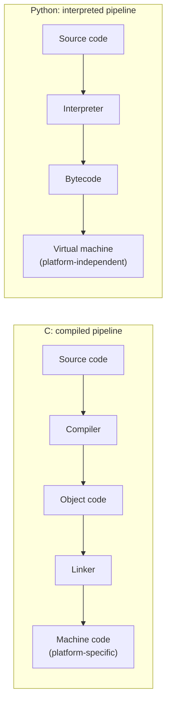

# From Data to Output: Choosing the Right Programming Language

---

## Introduction

Every software application, from a microcontroller reading room temperature to a machine learning platform training neural networks, performs the same fundamental act: it accepts input, processes that data, and produces output. What separates a reliable, high-performing application from a fragile one is the quality of each stage in this input–processing–output (IPO) pipeline — and, above all, the programming language chosen to implement it. Computer languages provide a convenient, standardized way for people to instruct machines (Shirer, 2026), yet each carries distinct advantages and disadvantages: C compiles to fast, memory-efficient machine code, while Python trades execution speed for readable syntax and a rich library ecosystem (Dashdamirli, 2025). Because no single language suits every scenario, and because the consequences of a language choice can affect implementation cost, product quality, and maintenance costs for years after the decision is made (Farshidi et al., 2021), selecting a language is an engineering decision rather than a matter of taste. This paper argues that programming languages are purpose-built communication systems whose syntax, semantics, and level of abstraction determine how effectively data is transformed into valuable outputs; sound engineering practice therefore matches those characteristics to system requirements instead of programmer preference. The discussion first assesses the purpose, use, and application of computer languages; then explains how computer languages parallel human languages; next details the relationship between semantics and syntax and the manipulation of data through input, processing, and output for operations, evaluation, intelligence, and machine learning; compares C-based languages with high-level languages such as Python, supported by a diagram of their contrasting execution pipelines; and closes with the rationale programmers apply when selecting a programming language.

## The Purpose, Use, and Application of Computer Languages

The purpose of a computer language is communication. Computer languages exist so that people can provide information and instructions to machines in a standardized form that the machine can execute to perform tasks (Lesson 4 course text; Shirer, 2026). This standardization is what made the explosive growth of computation possible: once languages and their translation programs matured, applications could be developed more quickly and reliably, driving adoption across business, scientific applications, and daily life (Shirer, 2026). A computer's central processing unit natively executes only machine code — dense numerical instructions that are extraordinarily difficult for humans to read, write, or edit — so virtually every modern language exists to bridge the gap between human-readable intent and machine-executable instructions (Doskas, 2021; Shirer, 2026).

In use, a programming language never operates alone; it is embedded in a toolchain. The programmer writes **source code** in an editor, and a **compiler** makes several passes over that file, assigning storage and translating each statement into object code; a **linker** then combines the object modules from all procedures into a final executable, substituting actual addresses for symbols (Shirer, 2026). Alternatively, an **interpreter** translates and executes one line at a time, enabling the interactive write-and-debug workflow of languages such as BASIC and, later, Python (Doskas, 2021; Shirer, 2026). Low-level languages rely on an **assembler** to convert symbolic instructions into machine code (Doskas, 2021). Modern implementations are rounded out by program libraries — collections of utility routines for graphics, database processing, and countless other domains that extend what the language alone can do (Shirer, 2026). The practical payoff is well documented: modern optimizing compilers produce code nearly as efficient as expert assembly, which is why most software today is written in high-level languages (Shirer, 2026).

The applications of computer languages span every context in which computation creates value. In the language of the IPO model, applications take input from humans or machines, process it, and generate output that is displayed, printed, or stored for later use; the quantity and quality of that input, processing, and output determine application performance and reliability (Lesson 4 course text). Those outputs serve four broad purposes identified in the course materials: **operations** (executing transactions and running processes), **evaluation** (reporting and analysis of results), **intelligence** (deriving insight from aggregated data), and **machine learning** (training models from data pipelines). The sections that follow examine how the structure of a language governs each of these stages.

## Computer Languages as Human Languages

Computer languages are usefully understood through analogy with human languages. In both, communication is the primary goal, with a diverse set of secondary goals that depend on context (Lesson 4 course text). Both systems pair a **syntax** — the grammar governing how symbols such as words, numbers, and punctuation may be combined — with **semantics** — the rules that interpret the meaning of statements built from that syntax (Shirer, 2026). The parallel is direct: a sentence that is grammatically well formed can still be nonsense, just as the expression `1 + pizza` may comply with a language's syntax while being semantically meaningless because a number and a word cannot be added (Shirer, 2026).

The analogy also extends to how both systems manage complexity. Human communication relies on summarization, defined terms, and reused phrasing to avoid restating every detail; programs achieve the same effect through **abstraction**. Abstraction is built on the principle that any piece of functionality a program uses should be implemented once and never duplicated, and it is realized through **subroutines** — sequences of statements that perform a specific task, such as checking whether a customer's name exists in a text file, and that can be invoked wherever needed rather than repeated (Shirer, 2026).

Where the analogy breaks down is strictness. Human languages tolerate ambiguity because human listeners can usually recover the intended meaning; computer languages cannot afford that tolerance because the consequences of misinterpreting instructions are severe (Shirer, 2026). Computer languages therefore demand far stricter adherence to their rules than natural languages — famously, the failure of one multimillion-dollar space rocket was attributed to a misplaced comma in a program instruction (Shirer, 2026). A program must comply with both the syntactic and semantic rules of its language if it is to execute correctly at all, whereas a human sentence with a grammatical slip rarely derails a conversation.

The parallels between human and computer languages also emerge in how practitioners acquire fluency. Early in my career as a draftsman, I worked extensively with Arc Macro Language (AML), a command‑driven scripting system whose sequential structure resembled procedural instructions in natural language. When geographic information systems became central to municipal operations, I transitioned to ESRI’s Arc 3.2 platform and began reviewing custom mapping scripts developed for the City of Phoenix. Because I already understood every AML command, the conditional logic and syntactic patterns in those scripts—such as if/else structures—were immediately recognizable. This familiarity allowed me to infer meaning from context much as multilingual speakers transfer knowledge between linguistic systems. As a result, I learned the new language organically and eventually wrote custom programs that replaced vendor‑developed solutions, saving the City substantial development costs. This experience reinforces the strictness described in the course materials: unlike human listeners who tolerate ambiguity, computers require precise, rule‑bound instructions to execute tasks reliably . It also illustrates the broader principle that programming languages, like human languages, rely on syntax and semantics working together to convey meaning effectively.
## Semantics, Syntax, and the IPO Data Pipeline

The relationship between semantics and syntax is the heart of the data pipeline. **Semantics** define the logic of the code — what the program actually does with data — while **syntax** is the grammar of the particular language in which that logic is expressed, and it is the syntax that the compiler checks during translation (Lesson 4 course text). The same semantics can therefore be written in radically different syntaxes. Doskas (2021) illustrates this by accumulating three values in three languages. In C, a strongly typed, compiled language, the programmer must first declare variables before use:

```c
#include <stdio.h>
int main() {
    int x; int y; int z; int accumulator;
    x = 7; y = 4; z = 8;
    accumulator += y; accumulator += x; accumulator += z;
    printf("%d", accumulator);
    return 0;
}
```

The same logic in COBOL is organized into divisions, sections, and English-like statements (`ADD Y, X, Z GIVING ACCUMULATOR`), and in Python it collapses to a few untyped lines executed directly by an interpreter — no declarations, no compilation step, and even an interactive shell in which each statement can run as it is typed (Doskas, 2021):

```python
x = 7
y = 4
z = 8
accumulator = y
accumulator += x
accumulator += z
print(accumulator)
```

Three syntaxes, one semantics: take three inputs, process them by summation, and output the result. That is the IPO model in miniature.

Each stage of the pipeline depends on language structure. At the **input** stage, data arrives from humans (keystrokes, forms, files) or machines (sensors, network messages), and the language's type system shapes how that data is received: C requires variables to be declared with types before use, which lets the compiler validate data handling before the program ever runs, whereas Python's dynamic typing defers such checks to runtime (Doskas, 2021). At the **processing** stage, the semantics manipulate data through language constructs — variables, and the three control structures of structured programming: sequence, selection, and repetition — organized into procedures in a top-down, procedural design, or into classes that model real-world objects in a bottom-up, object-oriented design (Lesson 4 course text). Strong typing is not merely pedantry: design features measurably affect correctness. Coblenz (2017) demonstrates that when Java programmers relied on the `final` keyword to express immutability, every participant in his user study made an immutability mistake — one producing a bug and another a security vulnerability — whereas users of his Glacier extension, which enforced transitive immutability statically, succeeded and had errors caught at compile time. At the **output** stage, results are rendered to a screen, printed, or stored for later use (Lesson 4 course text).

The value of those outputs is realized across the four application contexts. In **operations**, outputs execute transactions — a web application that calculates a pizza order's price from ingredient and size inputs produces an operational output (Brborich et al., 2020). In **evaluation**, outputs report on and analyze results, supporting decisions. In **intelligence**, aggregated data yields insight, as when businesses consolidate operational records into decision-support information. In **machine learning**, the pipeline culminates in trained models: Wiejak and Smołka (2024) fed identical test datasets to linear regression, support vector machine, and k-means clustering implementations in Python, Java, R, Julia, and C#, measuring running time, lines of code, and model accuracy as the outputs of each language's toolchain. Notably, they concluded that interpreted-language libraries were more effective than compiled-language libraries for creating machine learning solutions — evidence that the language chosen for the pipeline shapes the quality and efficiency of its final output (Wiejak &amp; Smołka, 2024).

## Comparison: C-Based Languages and High-Level Languages Such as Python

C-based languages and high-level scripting languages such as Python occupy opposite ends of the abstraction spectrum, and their differing execution pipelines explain most of their trade-offs. C source code is compiled to object code and linked into native machine code for a specific platform; Python source code is interpreted, compiled on the fly to bytecode, and executed on a virtual machine that is independent of any single platform (Doskas, 2021; Shirer, 2026). Figure 1 contrasts the two pipelines.

**Figure 1.** *Compiled C pipeline versus interpreted Python pipeline.*



*Note. Adapted from descriptions of compilation and interpretation in Doskas (2021) and Shirer (2026).*

The benchmark evidence quantifies the differences (see Table 1).

**Table 1.** *C-based languages versus Python: advantages and disadvantages.*


| Attribute         | C-based languages                                              | Python                                                                         |
| ----------------- | -------------------------------------------------------------- | ------------------------------------------------------------------------------ |
| Execution speed   | Fast; direct native code                                       | Slow; interpreter and runtime overhead                                         |
| Memory efficiency | Small footprint                                                | Large runtime; on ESP8266, \~35 KB RAM left for applications vs. \~80 KB for C |
| Portability       | Must be rebuilt per platform                                   | Runs on any platform with the interpreter                                      |
| Development speed | Slower; declarations, manual memory management                 | Rapid; concise, untyped syntax                                                 |
| Typing            | Static, compile-time checks                                    | Dynamic, runtime errors possible                                               |
| Typical use cases | Operating systems, embedded systems, performance-critical code | Data science, machine learning, scripting, web backends                        |


On an ESP8266 microcontroller, a bubble sort of 1,000 elements completed in 68.9 ms in C but 24,541 ms in Python, and a simple 50,000-iteration loop took 2.5 ms in C versus 647.2 ms in Python (Dashdamirli, 2025). C's strengths follow from its design: direct hardware access, minimal runtime overhead, and mature toolchains make it the long-standing default for operating systems and embedded development (Dashdamirli, 2025; Doskas, 2021). Its costs are equally real: a steep learning curve involving pointers, manual memory allocation, and hardware register manipulation, plus platform-specific builds (Dashdamirli, 2025; Doskas, 2021).

Python inverts the trade-off. Its clean, readable syntax, extensive standard library, and interpreted nature accelerate development and rapid prototyping, and its data science and machine learning ecosystem is unmatched (Dashdamirli, 2025; Wiejak &amp; Smołka, 2024). The costs are execution speed — orders of magnitude slower than C on computation-intensive tasks — runtime memory overhead, and deferred type errors that surface only when code runs (Dashdamirli, 2025; Doskas, 2021). Interestingly, Dashdamirli (2025) found power consumption on the microcontroller was effectively identical across languages, meaning language choice can rest on performance and development considerations — although slower execution still means more total energy per task.

The comparison should not be read as a verdict. Poorly written code can be produced in any language, and a well-written application can be ported into any language when best practices, coding standards, and documentation are followed (Lesson 4 course text). The lesson of Table 1 is fit, not rank: C fits resource-constrained and performance-critical contexts, and Python fits contexts where development speed, readability, and library ecosystems dominate.

## Rationale for Selecting a Programming Language

If no language is universally superior, selection must start from system requirements rather than programmer preference — the course text is emphatic that language selection "should always be about the client and never about the preferences of the programmer" (Lesson 4 course text). Several considerations follow. The nature and type of the use case determines domain fit: SQL for declarative querying, Python for machine learning pipelines, C for firmware. Scalability requirements shape long-term performance headroom; application complexity drives paradigm fit among procedural top-down design, object-oriented bottom-up design, or the hybrid approach most teams actually use (Lesson 4 course text). Resource constraints of time and money force the development-speed versus execution-speed trade-off quantified above. Security requirements argue for languages whose features enforce correctness — Coblenz's (2017) immutability findings show language-level guarantees can eliminate entire classes of bugs and vulnerabilities that merely conventional discipline cannot. Available hardware resources, short-term versus long-term stakeholder goals, community and vendor support, library availability, performance requirements, and interoperability with existing systems complete the checklist (Lesson 4 course text; Farshidi et al., 2021).

Peer-reviewed evidence strengthens these considerations. Brborich et al. (2020) compared maintenance of functionally equivalent procedural (Python/Flask) and object-oriented (Java/Spring Boot) backends and found subjects working with the procedural version were, on average, 8.33% more effective and about one task per hour faster, with both differences statistically significant — though the authors caution that the observational, single-institution design limits generalization. Farshidi et al. (2021) formalized selection itself as a multi-criteria decision-making problem, capturing criteria such as developer availability and documentation consistency in a decision model validated across seven industry case studies, where participants reported significantly more insight into the selection process along with reduced decision time and cost. Their cases also underline that selection consequences — implementation cost, result quality, and maintenance cost — may not be felt for years after the choice is made (Farshidi et al., 2021).

## Conclusion

Programming languages are purpose-built communication systems: standardized grammars and semantics through which humans instruct machines to transform input data into valuable outputs. The evidence reviewed here supports the thesis that syntax, semantics, and abstraction level — together with the ecosystem of libraries and communities surrounding a language — determine a language's fitness for a given purpose. Compiled, low-abstraction languages such as C deliver speed and memory efficiency for constrained environments (Dashdamirli, 2025); interpreted, high-abstraction languages such as Python deliver development speed and dominant machine learning tooling (Wiejak &amp; Smołka, 2024); design features such as enforced immutability deliver correctness and security (Coblenz, 2017); and paradigm choice measurably affects maintainability (Brborich et al., 2020). Language selection is therefore an engineering decision tied to the full data-to-output value chain: a programmer who begins from system requirements, weighs the considerations above, and applies a structured decision process (Farshidi et al., 2021) is choosing not merely a syntax, but the quality, cost, and longevity of every output the application will ever produce.

## References

Brborich, W., Oscullo, B., Lascano, J. E., &amp; Clyde, S. (2020). An observational study on the maintainability characteristics of the procedural and object-oriented programming paradigms. In *2020 IEEE 32nd Conference on Software Engineering Education and Training (CSEE&amp;T)* (pp. 1–10). IEEE. [https://doi.org/10.1109/CSEET49119.2020.9206213](https://doi.org/10.1109/CSEET49119.2020.9206213)

Coblenz, M. (2017). Principles of usable programming language design (Extended abstract). In *2017 IEEE/ACM 39th International Conference on Software Engineering Companion (ICSE-C)* (pp. 469–470). IEEE. [https://doi.org/10.1109/ICSE-C.2017.24](https://doi.org/10.1109/ICSE-C.2017.24)

Dashdamirli, N. (2025). Analyzing the performance and practicality of C, Rust, Python, and Lua programming languages for developing microcontroller applications. In *2025 6th International Conference on Problems of Cybernetics and Informatics (PCI)* (pp. 1–5). IEEE. [https://doi.org/10.1109/PCI66488.2025.11219778](https://doi.org/10.1109/PCI66488.2025.11219778)

Doskas, C. (2021). Python programming: Object-oriented programming. *ISSA Journal*, 44–47.

Farshidi, S., Jansen, S., &amp; Deldar, M. (2021). A decision model for programming language ecosystem selection: Seven industry case studies. *Information &amp; Software Technology, 139*, 106640. [https://doi.org/10.1016/j.infsof.2021.106640](https://doi.org/10.1016/j.infsof.2021.106640)

Shirer, D. L. (2026). Computer programming languages. In *Salem press encyclopedia of science*. Salem Press.

Wiejak, T., &amp; Smołka, J. (2024). Performance of machine learning tools: Comparative analysis of libraries in interpreted and compiled programming languages. *Journal of Computer Sciences Institute, 33*, 339–345. [https://doi.org/10.35784/jcsi.6589](https://doi.org/10.35784/jcsi.6589)

> **Note:** The Lesson 4 course text is cited in-text as "(Lesson 4 course text)" as a placeholder — replace it with the citation format your university requires for course materials (often the instructor's name, year, and course shell URL), and confirm whether course materials count toward your reference list.
