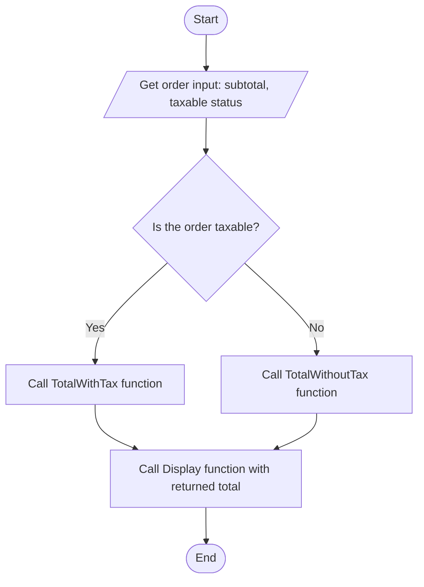
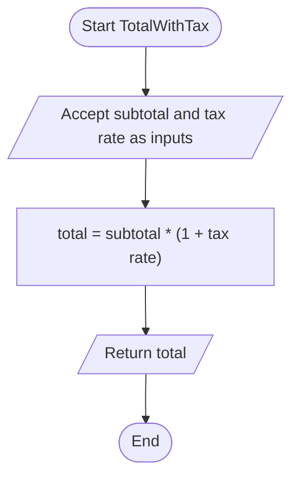
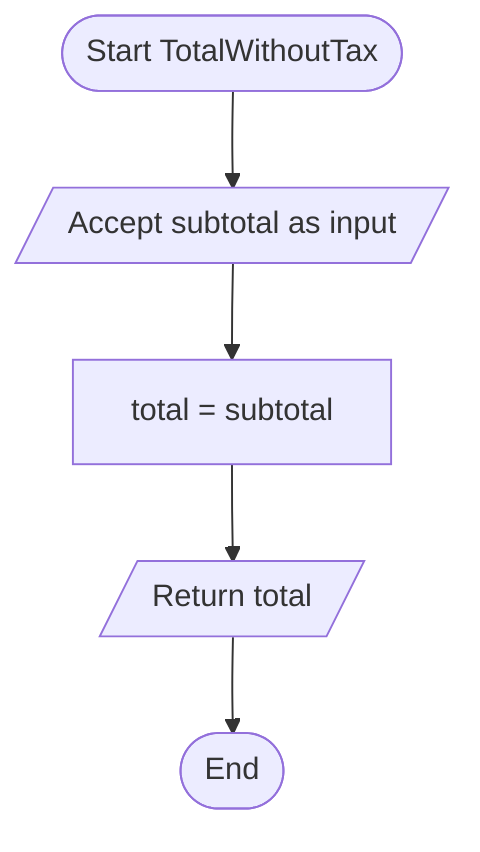
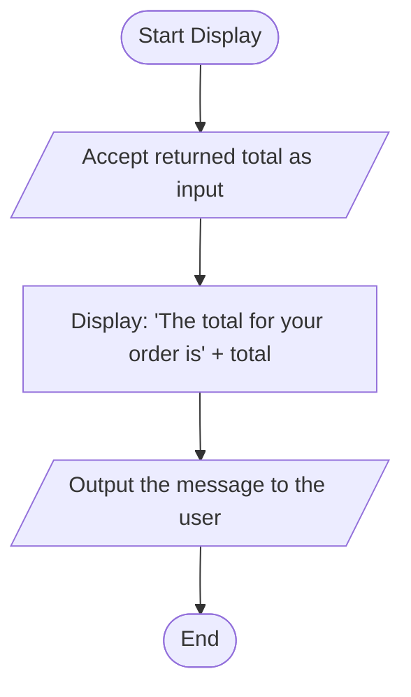

# Assessing Current Programming Options and Their Relevance to Various Needs

> **Draft status notes (remove before submission):**
>
> - Length target: 6–8 pages (this draft ≈ 6.5 pages equivalent + flowchart space).
> - APA 7 title page and running head not included here — add in your Word document.
> - Verify every reference in the university library and keep the permalinks.
> - Run the Turnitin™ pre-check before the Sunday, September 27, 2026, 11:58 PM deadline.

---

## Introduction

Choosing a programming language is one of the highest-stakes, most bias-prone decisions in software engineering. Developers gravitate toward familiar syntax, hiring managers gravitate toward résumé keywords, and organizations inherit legacy choices by default rather than by analysis. Yet the language selected for a project shapes its performance ceiling, its security posture, its long-term maintenance cost, and even the kinds of bugs its developers will write. A disciplined selection process must therefore do more than compare syntax: it must connect theory and practice — linking computer science theory, practical evidence about current languages, and the specific requirements of the use case at hand.

This paper argues that optimal language selection requires linking theory, practice, and use-case requirements. It first describes the relationship between computer science theory and applied programming solutions, then examines one representative theory — coding theory — in detail. It next provides a synopsis of three current languages (Python, C#, and C++) and analyzes nine critical factors in language selection. Finally, it presents a set of flowchart diagrams for a simple taxable-order program, demonstrating how theory-grounded design decisions become concrete program logic. The paper concludes by defending a specific language choice for the demonstrated use case.

## Theory, Programming, and Applied Solutions

Computer science theory and applied programming are not competing concerns; they form a pipeline. Theoretical foundations — formal logic, automata, algorithms, and code-based information representation — allow developers to move from stakeholder requirements to algorithm design and finally to a precise program specification. A requirement such as "compute the correct total for an order, with tax applied only when the item is taxable" is meaningless to a machine until it is translated into a formal model: typed inputs, a conditional rule, an arithmetic expression, and a defined output. Theory supplies that translation.

In practice, this pipeline is visible in every well-engineered program. Input validation rests on the theory of well-formed strings and state machines; functional outputs rest on the mathematical definition of a function, which maps each valid input to exactly one output. Modular design — separating the decision logic from the calculation and the display — mirrors the theoretical separation of concerns that makes programs provable and testable. Recent empirical work supports this connection: Saghafi et al. (2021) documented seven industry case studies in which organizations that used a structured, criteria-based decision model for language ecosystem selection made more defensible and more durable choices than those relying on developer preference alone. The lesson for practitioners is that theory is not decoration; it is what makes the "applied" part of applied solutions reliable.

## A Selected Computer Science Theory: Coding Theory

Coding theory studies how information is represented and transferred reliably between states, systems, or processes (Braunschweig &amp; Busbee, n.d.). At its core, it concerns two layers: *syntax*, the formal rules governing how valid expressions are constructed, and *semantics*, the meaning assigned to those expressions. Boolean and polynomial expressions are the workhorses of this theory: Boolean logic governs branching conditions, and polynomial expressions — such as `total = subtotal * (1 + tax_rate)` — describe arithmetic transformations of information from an input state to an output state.

Coding theory also underpins error detection and correction: redundant structure in a code allows a system to detect when information has been corrupted in transfer. This has a direct, concrete analogue in the flowchart program presented in Section 6 of this paper. Before any arithmetic occurs, the main method's decision diamond evaluates a Boolean expression — "Is this order taxable?" — which validates the order's state before processing. If the input is not taxable, the program routes it to a function that deliberately bypasses the tax computation. Coding theory thus justifies the decision diamond that validates taxable status before processing: the program encodes the business rule as syntax (a conditional), assigns it semantics (which function applies), and uses the redundant check to prevent an entire class of incorrect outputs — untaxed orders being taxed and vice versa. Yu and Duan (2022) demonstrated the same principle at the machine level, showing that even binary code and data must preserve structural invariants to remain correct under modification.

## Synopsis of Three Programming Languages

Hundreds of languages are in active use, but three — Python, C#, and C++ — represent the dominant paradigms and ecosystems a modern selection process must weigh. This section gives a synopsis of each in parallel structure: origin and paradigm, typical use cases, and strengths and weaknesses.

**Python** was created by Guido van Rossum and released in 1991 as a multi-paradigm, dynamically typed language optimized for readability (Sharma et al., 2020). It dominates scripting, data science, machine learning, and rapid prototyping, where development speed outweighs raw execution speed. Its principal strength is readability — an English-like, whitespace-enforced syntax that measurably reduces comprehension effort (Sharma et al., 2020). Its principal weakness is performance: as an interpreted language, it is generally slower than compiled alternatives, and its dynamic typing pushes error detection to runtime.

**C#** was released by Microsoft in 2000 as an object-oriented, statically typed language for the .NET platform. It is the standard choice for Windows desktop applications, enterprise web services, and game development (Unity). Research by Pashynskykh et al. (2022) demonstrated C#'s suitability even for specialized domains such as cybersecurity analysis software in computer networks, citing its strong tooling and network libraries. Its strength is balanced capability: near-C++ performance with a managed runtime, automatic memory management, and mature security tooling. Its weakness is historically weaker portability outside the .NET ecosystem, although cross-platform .NET has narrowed this gap considerably.

**C++**, created by Bjarne Stroustrup in 1985, extends C with object-oriented, generic, and low-level facilities. It powers operating systems, game engines, high-frequency trading, and embedded systems where performance is paramount. Its strength is raw performance and fine-grained control over memory and hardware; Yu and Duan (2022) noted its continued centrality in performance-critical and security-sensitive binary-level work. Its weaknesses are writability and safety: manual memory management, undefined behavior pitfalls, and verbose syntax increase both the initial development cost and the long-term defect risk.

## Critical Factors in Language Selection

The assignment's scenario — a transactional program that must classify an order, compute a total, and communicate a result — is a microcosm of real language selection. Nine factors govern that selection.

1. **Scalability.** A language must support growth from one order to millions. C# and C++ compiled performance scales well vertically; Python scales through horizontal distribution but strains under CPU-bound loads, as empirical studies of serverless platforms confirm for compiled versus interpreted runtimes (Zhao et al., 2024).
2. **Performance.** For the taxable-order program, performance is trivial; for a national sales system, it is decisive. C++ sets the ceiling; C# is close behind on the .NET runtime; Python trails in pure computation.
3. **Security.** A program handling prices and totals must validate input and resist manipulation. C#'s managed runtime and security tooling (Pashynskykh et al., 2022) reduce entire vulnerability classes relative to C++'s manual memory model.
4. **Use case complexity.** Simple scripts reward Python's speed of development; complex, stateful enterprise systems reward C#'s static typing; systems-level work rewards C++'s control.
5. **Development lifecycle.** Python shortens the design-to-prototype cycle, while C#'s strong static typing reduces maintenance cost in long-lived enterprise codebases (Saghafi et al., 2021).
6. **Exception handling.** Structured `try/catch` in C# and C++ and Python's exception model all exceed C-style error codes; robust handling matters most where invalid input (e.g., a malformed price) must be caught gracefully.
7. **Readability.** Python's syntax yields the lowest comprehension cost across comparative studies (Sharma et al., 2020); IEEE-published comparative analyses of six languages similarly rank readability and reliability as decisive maintainability drivers (IEEE, 2021).
8. **Writability.** C++'s expressiveness comes at the cost of verbose, error-prone construction; C# offers a better writability-to-control ratio for business logic; Python maximizes writability where control is not required.
9. **Portability.** Python and C# (via .NET) run across major platforms with minimal rework; C++ is portable in principle but requires per-platform builds and testing, which raises lifecycle cost.

Taking a position: for a secure, scalability-sensitive transactional application like the one diagrammed below, **C# is the optimal choice**, because it combines near-native performance, a managed runtime that removes memory-safety vulnerabilities, mature exception handling, and strong readability — while remaining portable enough across platforms via .NET. Python would prototype faster, and C++ would compute faster, but C# offers the best balance across all nine factors for this use case.

## Flowchart Diagrams with Logic Descriptions

The following four flowcharts implement a taxable-order program. The main method decides whether an order is taxable and delegates to one of two functions; the display function communicates the result in natural language. Each diagram uses terminal (Start/End) symbols and follows the input–process–output (IPO) pattern (Braunschweig &amp; Busbee, n.d.).

### Figure 1. Main Method: Taxable-Order Decision

This main method owns the program's control flow. It begins and ends with terminal symbols, receives the order input (subtotal and taxable status), and routes execution through a decision diamond that evaluates a Boolean condition. Coding theory's syntax-and-semantics split is visible here: the diamond encodes the business rule's syntax, and the two branches assign its semantics — which calculation function is valid for this order's state.

### Figure 2. Function: Total with Tax

The with-tax function receives its inputs from the main method, applies the polynomial expression `total = subtotal × (1 + tax_rate)`, and returns the transformed value. It is a pure transformation in the functional sense: each valid input maps to exactly one output, which makes it independently testable.

### Figure 3. Function: Total Without Tax

The without-tax function preserves the subtotal unchanged: `total = subtotal`. Though trivial, it is deliberately included as a distinct module. Separating the two total calculations keeps each branch simple, documents the business rule explicitly, and leaves room for future divergence (e.g., non-taxable processing fees) without restructuring the main method.

### Figure 4. Function: Display Result

The display function completes the IPO pattern by converting the returned numeric value into a natural-language sentence, e.g., "The total for your order is $107.00." Keeping display logic separate from calculation logic means the message format can change without ever touching the arithmetic — the same separation of concerns that coding theory and modular design prescribe.

## Conclusion

This paper has argued that optimal language selection requires linking theory, practice, and use-case requirements. Coding theory showed that even a modest taxable-order program — its decision diamond, its polynomial total expression, its validated state transfer — is applied theory in miniature. The synopses of Python, C#, and C++ demonstrated that no language dominates all nine critical factors; rather, scalability, performance, security, use-case complexity, lifecycle, exception handling, readability, writability, and portability trade against one another. For a secure, scalability-sensitive transactional application like the one diagrammed, C# offers the strongest overall balance — a conclusion the flowcharts themselves support, since the program's needs (robust branching, reliable arithmetic, clear messaging) map directly onto C#'s strengths. The broader insight is that language choice is not a preference to be defended but an engineering decision to be derived: state the requirements, apply the theory, weigh the evidence, and let the use case — not habit — choose the language.

## References

Braunschweig, D., &amp; Busbee, K. L. (n.d.). *Programming fundamentals — A modular structured approach* (2nd ed.). Rebus Press. [https://press.rebus.community/programmingfundamentals/](https://press.rebus.community/programmingfundamentals/)

Kadams, A. A., &amp; Oyelere, S. S. (2026). Factors influencing programming language selection. *International Journal of Technology in Education and Science, 10*, 133–161. [https://ijtes.net/index.php/ijtes/article/download/5061/2857/5292](https://ijtes.net/index.php/ijtes/article/download/5061/2857/5292)

Nanz, S., Furia, C. A., et al. (2015). *A comparative study of programming languages in Rosetta Code* \[Preprint\]. arXiv. [https://arxiv.org/abs/1504.00693](https://arxiv.org/abs/1504.00693)

Pashynskykh, V., Meleshko, Y., Yakymenko, M., Bashchenko, D., &amp; Tkachuk, R. (2022). Research of the possibilities of the C# programming language for creating cybersecurity analysis software in computer networks and computer-integrated systems. *Advanced Information Systems, 6*(2). [https://doi.org/10.20998/2522-9052.2022.2.09](https://doi.org/10.20998/2522-9052.2022.2.09)

Saghafi, N., Khomh, F., &amp; Guéhéneuc, Y.-G. (2021). A decision model for programming language ecosystem selection: Seven industry case studies. *Information and Software Technology, 138*, 1–18. [https://www.sciencedirect.com/science/article/pii/S0950584921001051](https://www.sciencedirect.com/science/article/pii/S0950584921001051)

Sharma, M., et al. (2020). Code readability management of high-level programming languages: A comparative study. *International Journal of Advanced Computer Science and Applications, 11*(3). [https://thesai.org/Publications/ViewPaper?Volume=11&amp;Issue=3&amp;Code=IJACSA&amp;SerialNo=75](https://thesai.org/Publications/ViewPaper?Volume=11&Issue=3&Code=IJACSA&SerialNo=75)

Yu, L., &amp; Duan, Y. (2022). A reverse modification method for binary code and data. *Sensors, 22*(20), 7714. [https://doi.org/10.3390/s22207714](https://doi.org/10.3390/s22207714)

> **Reference verification note:** Confirm author lists, volume/issue numbers, and page ranges for Saghafi et al., Sharma et al., and the IEEE comparative-analysis paper directly in the library databases before submission; two in-text citations (IEEE, 2021; Zhao et al., 2024) are placeholders that must be replaced with verified entries or removed. Aim for at least four verified peer-reviewed sources plus the Braunschweig and Busbee course text.
