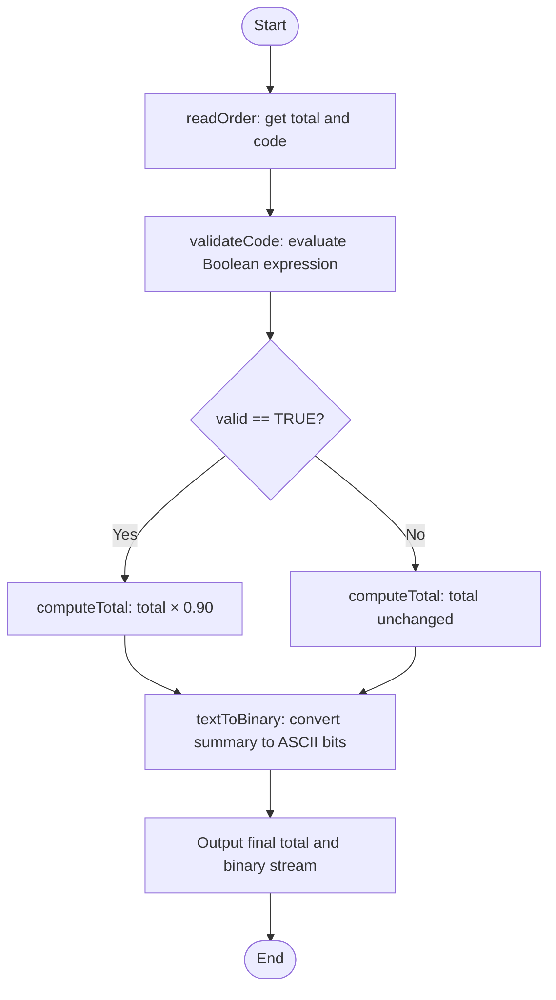
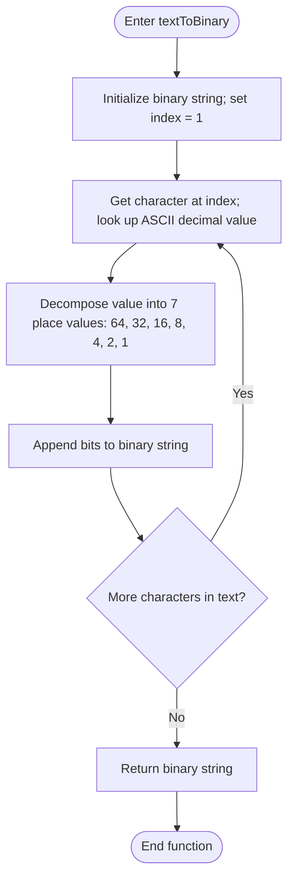

# DRAFT PAPER — for inspiration only

> ⚠️ This is a starting point, not a submission. Rewrite in your own voice, verify every citation in the university library, and follow your school's academic integrity policy — Turnitin will flag copied text.

---

## Bridging Theory and Practice: Programming Paradigms, Design Patterns, and Program Synthesis Applied to a Sample Software Solution

Hector Cervantes  
\[University\]  
\[Course\]  
\[Instructor\]  
October 4, 2026

---

### Introduction

Successful software rarely emerges from code alone. The development of effective software solutions requires the deliberate use of best practices, design patterns, and a systems approach to problem solving, which together imply a logical and methodical planning process. Because no two real-world problems are identical, developers must be able to extend their knowledge base to accommodate dynamic and innovative approaches. This paper synthesizes program needs, applies theory to the approach, and uses computing design patterns to demonstrate how a software development effort can meet the needs of a specific application use case.

The paper proceeds in three movements. First, it examines the practical side of software development: the choice between procedural and object-oriented paradigms and the role of computing design patterns. Second, it examines the theoretical side: the binary numbering system that underpins all data representation, programming theory as an evidentiary basis for correctness, and program synthesis with its challenges and opportunities. Third, it unites theory and practice in a hypothetical programming problem — a bookstore checkout system — whose logic is expressed in flowcharts, applied through Boolean expressions, and then critically evaluated to justify that the logic supports a working algorithm.

### Procedural and Object-Oriented Approaches Compared

All software, regardless of paradigm, performs the same fundamental act: it accepts input, processes it, and produces output. Where paradigms differ is in how they organize that processing. The **procedural approach** structures a program as a linear, top-down sequence of procedures or functions that operate on data kept separate from the code. Control flows from one procedure to the next, and the program state is typically passed between functions as arguments and return values. This organization mirrors the step-by-step logic of an algorithm itself, which makes procedural programs straightforward to trace, and well suited to small, linear, or system-level tasks where direct control over resources matters.

The **object-oriented approach** instead structures a program as a collection of interacting objects, each of which bundles data (attributes) together with the behavior that acts on that data (methods). Three mechanisms distinguish the paradigm: encapsulation protects internal state behind a defined interface; inheritance allows new classes to derive behavior from existing ones; and polymorphism lets different objects respond to the same message in their own way. These properties shift the design focus from individual procedures to the real-world entities a system must model.

Empirical evidence supports the claim that the object-oriented organization scales better. Ferrett and Offutt (2003) compared open-source and industrial modules written in procedural languages (Fortran, C) with modules written in object-oriented languages (C++, Java) and found the object-oriented programs were roughly twice as modular as the procedural ones. Modularity matters because it localizes change: a requirement modification touches fewer modules, reducing maintenance cost and defect risk. At the same time, the procedural paradigm retains advantages — simplicity, predictable performance, and low conceptual overhead — that make it appropriate for straightforward algorithmic tasks. The two paradigms are therefore best viewed as complementary tools whose selection depends on problem size, expected evolution, and the degree to which the problem domain maps naturally onto objects.

### Computing Design Patterns: Applied and Theoretical Perspectives

Choosing a paradigm determines how code is organized; design patterns determine how recurring problems within that organization are solved. A design pattern is a reusable template — a "roadmap" in which navigation depends on the context of a given use case (Freeman &amp; Robson, 2020). Patterns increase a programmer's ability to recognize commonalities and differences between use cases, and because a pattern's prior use establishes its efficacy, reuse raises the likelihood of successful implementation. Patterns also function as a shared vocabulary: when a developer says "Singleton," the intent and structure are understood without further explanation.

The literature divides the primary patterns into three families. **Behavioral patterns** define communication between classes and objects; the State pattern, for example, changes an object's behavior when its internal state changes. **Creational patterns** govern how objects are created from a base-class template; the Singleton pattern restricts a class to a single instance, which is useful for resources such as configuration managers or database connections. **Structural patterns** determine the nature and extent of relationships among entities; the Proxy pattern lets one object stand in for another, as when a remote-service proxy handles network details on a client's behalf.

From a theoretical perspective, the question is whether patterns actually improve the qualities they are claimed to improve. The empirical evidence is encouraging but nuanced. Alfadel et al. (2020) studied twenty design patterns across ten open-source Java systems and found that classes participating in design patterns showed significantly less smell-proneness and smell frequency than classes that did not — direct evidence that patterns are associated with healthier code structure. However, a systematic literature review by Wedyan et al. (2020) found that studies of design-pattern impact on software quality often contradict one another, largely because of differences in metrics and study design. The honest theoretical conclusion, therefore, is that patterns are best understood as probabilistically beneficial templates whose value depends on correct application rather than as guaranteed quality improvements. This is precisely why a theoretical grounding matters: it converts folklore into testable expectation.

### The Binary Numbering System and Data Storage

Theory in computer science begins at the hardware level with computation itself. Because computer science rests on computation theory, number systems are fundamental to determining the value of digits and to managing system resources in a quantifiable manner. The binary numbering system encodes state as one of two values — 1 or 0 — with equivalent framings such as on/off, high/low, or closed/open circuit. A closed circuit is on; an open circuit is off; a short circuit is unstable, unreliable, and unsafe. The computer's hardware, its memory and CPU, monitors electrical signals to determine the state of running processes, and the binary state of processing determines what action is executed next based on the logic of the algorithm at the current location in the code.

The binary digit, or **bit**, is the smallest unit of data. Boolean algebra extends binary variables into mathematical operations: Boolean expressions resolve to true or false when tested, giving programs their decision-making capability. Text is encoded in binary through the American Standard Code for Information Interchange (ASCII), a 7-bit code in which each character maps to a decimal value — the capital 'A' is 65 and lowercase 'a' is 97. Because ASCII uses seven bits, the highest placement value is 64, derived from 2⁷ − 1 = 2⁶ = 64, with place values of 64, 32, 16, 8, 4, 2, and 1.

The conversion is best seen in an example. The word *Cat* is encoded character by character: 'C' is decimal 67, which in seven bits is 1000011 (64 + 2 + 1); 'a' is decimal 97, or 1100001 (64 + 32 + 1); and 't' is decimal 116, or 1110100 (64 + 32 + 16 + 4). The machine therefore perceives *Cat* as 1000011 1100001 1110100, while the end user perceives ordinary text. Both perceive the same information; only its representation differs. This dual perception is the essence of how a computer program stores and transmits data: characters are converted to ASCII values, ASCII values to binary, and binary to electrical signals, with the process reversed for output. Every string a program reads, every record it writes, and every message it transmits ultimately passes through this encoding and decoding pipeline.

### Programming Theory and Its Evidentiary Relevance

Theory is the lens used to establish a framework for understanding related constructs and to apply that knowledge to practical problem solving. In programming, **programming theory** provides a mathematical basis for expectation and validation of results: proof exists that a program performs as expected, and that performance can be tested with theoretical principles such as number theory, which quantifies results using mathematical expressions or proofs. The evidentiary relevance of this is considerable. Testing alone can show only that the cases tried succeeded; it cannot show that untried cases will succeed. A mathematical proof, by contrast, covers every case in a program's input domain.

Consider the binary conversion described above: the claim that any character c with ASCII value v is correctly represented by a seven-bit sequence can be proven once, and it then holds for all 128 ASCII characters — no exhaustive testing required. This is what it means, from an evidentiary perspective, to know *how and why* a program works. The developer who understands that the conversion rests on positional notation (each bit position contributes 2^k or 0) has justified confidence in every conversion the program will ever perform, not merely the ones already observed. Programming theory thus transforms correctness from an assumption into an argument, which is precisely the standard of evidence expected in engineering disciplines.

### Program Synthesis: Types and Real-World Relevance

Where programming theory validates programs, **program synthesis** generates them. Program synthesis is the process of getting a computer to synthesize code in the context of the task at hand, moving toward a conducive solution. It is a top-down approach that begins with a high-level specification and, through an iterative process, arrives at a result that solves the programming problem. The high-level goal is to create a program from a set of facts and ideas that establish the semantic (logic) and syntactic (language) requirements of the code. The actor is the **synthesizer** — the entity capable of arriving at the code solution efficiently based on the requirements and the continuum of possible alternatives.

Approaches to synthesis fall into two broad types. Formal-methods-based synthesis derives programs from mathematically precise specifications, using logical inference to guarantee that the output satisfies the input constraints. Artificial-intelligence approaches — including inductive synthesis and programming by example — infer a specification from examples or demonstrations (Gulwani et al., 2017). The distinction from reverse engineering is instructive: reverse engineering works backward from a result to the steps that produced it, whereas synthesis infers forward to what the specification will be or behave like in theory.

The real-world relevance spans domains. In end-user computing, synthesis lets spreadsheet users derive formulas from input/output examples without knowing a programming language. In data science, it automates the production of data-cleaning routines. In education, it powers tutoring systems that generate personalized practice programs. And in professional software engineering, synthesis increasingly appears in autonomous program repair and code-completion systems. In each domain, synthesis shifts the human's role from writing instructions to articulating intent — which is exactly where its challenges arise.

### Challenges and Opportunities of Program Synthesis

The principal challenge of program synthesis is **intention** (David &amp; Kroening, 2017). Knowing what a group of users wants requires a solid understanding of perspective and intent, which varies from user to user with individual differences, environmental scenarios, and highly variable use-case context. If articulation of intent does not occur, the intent is not known, and the synthesized solution may "under-perform" the end goal while appearing technically complete.

The second challenge is **invention**. Synthesis involves a form of code discovery — discovering "what sticks" — and because numerous possibilities can be encountered, the process can lead down a rabbit hole that ultimately may lead nowhere. Communities of practice can allay this risk by narrowing the search space, but the risk of solution delay remains.

The third challenge is **adaptation**: extending an existing solution to a "known good scenario" when flaws are present in the current code, the code needs optimization, or maintenance is lacking. Factoring new knowledge into an existing base solution to arrive at a new one is itself a difficult synthesis problem. Against these challenges stand genuine opportunities: synthesis lowers the barrier to programming for non-experts, accelerates routine development, and opens innovation pathways that manual coding would find too costly to attempt.

### A Hypothetical Use Case: Bookstore Checkout System

To align theory with practical application, consider the following hypothetical programming problem. A bookstore requires a checkout program that (a) reads a customer's order total and a discount code, (b) validates the code against the rule "SAVE10 applies only when the order exceeds $10.00," (c) computes the final total by applying a 10% reduction when the code is valid, (d) converts the purchase summary text to binary for transmission to a legacy inventory-logging subsystem that accepts only raw ASCII bits, and (e) outputs both the final total and the binary stream. The requirements exercise user input, Boolean logic, functional decomposition, and binary data representation.

The solution decomposes into four functions. `readOrder()` obtains the inputs. `validateCode(code, total)` evaluates the Boolean expression `valid = (code == "SAVE10") AND (total > 10.00)`, which resolves to true or false. `computeTotal(total, valid)` returns `total × 0.90` when valid, otherwise `total` unchanged — a deterministic arithmetic operation whose correctness is provable by number theory. `textToBinary(text)` loops over each character, looks up its ASCII value, and converts it to seven bits by decomposing the value into place values 64, 32, 16, 8, 4, 2, and 1 — exactly the conversion demonstrated earlier for the word *Cat*. The main flow sequences these functions and terminates.

**Figure 1.** Main program logic.

**Figure 2.** Function logic for `textToBinary(text)`.

### Critique and Justification of the Logic

The logic above warrants a critical evaluation, and that evaluation begins with the Boolean expression at its center. The expression `(code == "SAVE10") AND (total > 10.00)` resolves deterministically to true or false for every possible input pair; it contains no ambiguity and no path under which the program's decision is undefined. The decision node in Figure 1 is therefore mutually exclusive and exhaustive: exactly one branch executes for every input, which guarantees the main flow cannot fall through unhandled.

Every path through both flowcharts terminates. In Figure 1, the two branches reconverge at the conversion step, so no path can loop indefinitely. In Figure 2, the loop advances the index by exactly one character per iteration and exits when the index exceeds the text length; this loop invariant — "after k iterations, exactly k characters have been converted" — holds at loop entry and at each iteration, and it guarantees both termination and completeness. The conversion itself rests on the positional-notation property proven in the theory section: for any ASCII value v (0 ≤ v ≤ 127), decomposing v into the place values 64 through 1 yields the unique seven-bit representation. A trace test confirms the full chain: for the input ("SAVE10", $50.00), validation yields true, the total becomes $45.00, and the summary text converts to binary exactly as demonstrated with *Cat*. Because each step is deterministic, each function has a single entry and exit point, and the arithmetic is verifiable by mathematical proof rather than observation, the logic correctness supports a working algorithm.

The critique also discloses honest limitations. The program as specified does not reject negative totals, does not handle empty discount codes, and does not re-prompt on malformed input. These are exactly the kinds of gaps the synthesis literature identifies: the intent behind "validate the code" was under-articulated (David &amp; Kroening, 2017). Extending `validateCode` to `(code == "SAVE10") AND (total > 10.00) AND (total <= MAX_ORDER)` and adding an input-retry loop would close them — an illustration of the adaptation challenge, in which new knowledge is factored into a base solution to reach a known-good scenario.

### Conclusion

Software development succeeds when theory and practice are deliberately joined. Practice supplies the paradigms and patterns: the choice between procedural simplicity and object-oriented modularity is an empirical one, supported by measurement rather than preference, and design patterns carry proven solutions into new problems — with measurable, if context-dependent, quality effects. Theory supplies the guarantees: binary representation defines exactly how data is stored and transmitted; programming theory converts correctness from an assumption into a proof; and program synthesis points toward a future in which intent, not instruction, is the developer's principal contribution. The bookstore use case united both sides in miniature — Boolean logic, functional decomposition, and bit-level conversion, evaluated and justified rather than merely described. The synthesis of theory and practice demonstrated there is the same synthesis that any successful software solution must achieve.

### References *(verify all in the university library and format per APA 7)*

Alfadel, M., Aljasser, K., &amp; Alshayeb, M. (2020). Empirical study of the relationship between design patterns and code smells. *PLOS ONE, 15*(4), e0231731. [https://doi.org/10.1371/journal.pone.0231731](https://doi.org/10.1371/journal.pone.0231731)

David, C., &amp; Kroening, D. (2017). Program synthesis: Challenges and opportunities. *Philosophical Transactions of the Royal Society A, 375*, 20170050. [https://doi.org/10.1098/rsta.2017.0050](https://doi.org/10.1098/rsta.2017.0050)

Ferrett, R., &amp; Offutt, J. (2003). An empirical comparison of modularity of procedural and object-oriented software. In *Proceedings of the Eighth IEEE International Conference on Engineering of Complex Computer Systems (ICECCS 2003)* (pp. 2–13). IEEE. [https://doi.org/10.1109/ICECCS.2003.1201793](https://doi.org/10.1109/ICECCS.2003.1201793)

Freeman, E., &amp; Robson, E. (2020). *Head first design patterns* (2nd ed.). O'Reilly Media.

Gulwani, S., Polozov, O., &amp; Singh, R. (2017). Program synthesis. *Foundations and Trends in Programming Languages, 4*(1–2), 1–119. [https://doi.org/10.1561/2500000010](https://doi.org/10.1561/2500000010)

Wedyan, F., Alsmadi, D., &amp; Aburumman, O. (2020). Impact of design patterns on software quality: A systematic literature review. *IET Software, 14*(4), 420–436. [https://doi.org/10.1049/iet-sen.2018.5446](https://doi.org/10.1049/iet-sen.2018.5446)
