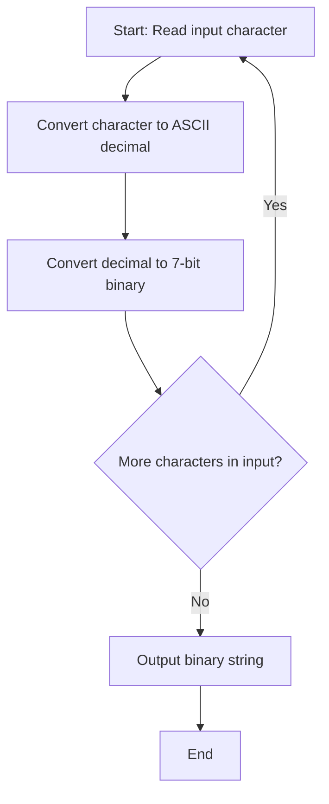

# Week 6 Study Guide

## Software Solutions, Theory, and Practice

**Week of Monday, Sep 28 – Sunday, Oct 4, 2026 · Assignment 6 due Sun, Oct 4, 2026, 11:58 PM (10 pts, Turnitin)**

---

## 📅 Day-by-Day Plan

| Day | Date   | Focus                                                                                      |
| --- | ------ | ------------------------------------------------------------------------------------------ |
| Mon | Sep 28 | Skim the whole Lesson 6 reading; set up paper template (APA, title &amp; reference pages). |
| Tue | Sep 29 | Deep read: Computing Design Patterns + Procedural vs. OOP comparison. Draft section 1–2.   |
| Wed | Sep 30 | Master binary &amp; ASCII: practice conversions (e.g., "Cat" → binary). Draft section 3.   |
| Thu | Oct 1  | Program synthesis: types, theory, challenges &amp; opportunities. Draft sections 4–5.      |
| Fri | Oct 2  | Build hypothetical use case + flowchart(s); draft sections 6–7 and the logic critique.     |
| Sat | Oct 3  | Full edit pass; verify all 8 prompts are covered; check APA + 4 peer-reviewed sources.     |
| Sun | Oct 4  | Turnitin pre-check, final proofread, submit before 11:58 PM.                               |

---

## 1. Computing Design Patterns (know cold)

A design pattern is a reusable "template" or roadmap for solving common programming problems (Freeman &amp; Robson, 2020). Benefits: reuse of proven solutions, better developer communication, faster recognition of commonalities/differences between use cases.

**Three primary types:**

- **Behavioral** — defines communication between classes/objects. Example: **State** (object changes behavior when its state changes).
- **Creational** — determines how objects are created from a base class template. Example: **Singleton** (a class with only one instance).
- **Structural** — determines relationships among entities in the system. Example: **Proxy** (one object stands in for another).

## 2. Procedural vs. Object-Oriented Approaches

- **Procedural**: program = sequence of procedures/functions operating on data; top-down flow; data and behavior are separate. Good for simple, linear tasks.
- **Object-Oriented**: program = interacting objects bundling data (attributes) + behavior (methods); supports encapsulation, inheritance, polymorphism. Good for large, evolving systems.
- **Compare/contrast in your paper**: organization of code, reusability, maintainability, real-world modeling, and when each is appropriate.

## 3. Binary Numbering System &amp; ASCII

- Binary = base-2; a **bit** (1 or 0) is the smallest unit of data. States: on/off, closed/open circuit (closed circuit = ON; short circuit = unstable/unsafe).
- Hardware (CPU/memory) monitors electrical signals to determine process states; Boolean algebra resolves expressions to true/false.
- **ASCII**: 7-bit character code. 'A' = 65, 'a' = 97. Highest placement value: 2⁷ − 1 = 64 (places are 64, 32, 16, 8, 4, 2, 1).
- **Worked example — "Cat"**:

| Letter | Decimal | 7-bit binary | Check            |
| ------ | ------- | ------------ | ---------------- |
| C      | 67      | 1000011      | 64 + 2 + 1       |
| a      | 97      | 1100001      | 64 + 32 + 1      |
| t      | 116     | 1110100      | 64 + 32 + 16 + 4 |

"Cat" → `1000011 1100001 1110100`. **Practice**: convert your own name to binary.

## 4. Programming Theory &amp; Program Synthesis

- **Programming theory**: mathematical basis for expectation and validation — proof that a program performs as expected (e.g., number theory, mathematical proofs).
- **Program synthesis**: getting the computer to generate code from a high-level specification (top-down, iterative). Uses formal methods and AI approaches.
- **Synthesizer**: the actor that arrives at the code solution based on requirements and alternatives.
- Key distinction: synthesis *infers* the specification/solution forward; **reverse engineering** works backward from a result to the steps that produced it.
- Semantics (logic) + syntax (language) requirements frame the synthesis goal.

## 5. Program Synthesis — Challenges &amp; Opportunities (David &amp; Kroening, 2017)

- **Intention**: user intent varies by individual, environment, and use case; unarticulated intent → "under-performing" the goal.
- **Invention**: code discovery / "discover what sticks" → risk of going down a rabbit hole; communities of practice help, but delay risk remains.
- **Adaptation**: extending flawed/unmaintained code to a "known good scenario" is hard; factoring in new knowledge adds further challenge.

---

## 📝 Assignment 6 Checklist (6–8 pages + flowchart(s), APA, ≥4 peer-reviewed sources)

1. ☐ Compare/contrast **procedural vs. object-oriented** approaches
2. ☐ Describe **design patterns** (applied + theoretical)
3. ☐ Explain **binary system** principles and data storage/transmission
4. ☐ Synthesize **programming theory** and evidentiary relevance
5. ☐ Explain **program synthesis**, its types, and real-world domain relevance
6. ☐ Describe synthesis **challenges and opportunities**
7. ☐ Create a **hypothetical use case** + sample program logic, with **flowchart(s)** (main, functions, Boolean expressions)
8. ☐ **Critique/justify** your logic — why it supports a working algorithm

### Rubric at a glance (10 pts total)

- High-level solution using theory + practice (3 pts)
- Follows instructions (2 pts) · Content &amp; critical thinking (2 pts) · Cohesion &amp; organization (2 pts) · Grammar/APA/resources (1 pt)
- Target: **9+ pts for "Exceeds Expectations" (A/A−)**

### Sample flowchart logic you can adapt for prompt 7

---

## Key Terms Flash List

Bit · Boolean algebra · ASCII · Behavioral/Creational/Structural pattern · Singleton · Proxy · State pattern · Program synthesis · Synthesizer · Intent/Invention/Adaptation challenges · Computation theory · Closed circuit = ON

## References in the lesson

- David, C., &amp; Kroening, D. (2017, September). *Program synthesis: Challenges and opportunities.* Royal Society.
- Freeman, E., &amp; Robson, E. (2020, December). *Head first design patterns* (2nd ed.). O'Reilly Media.
